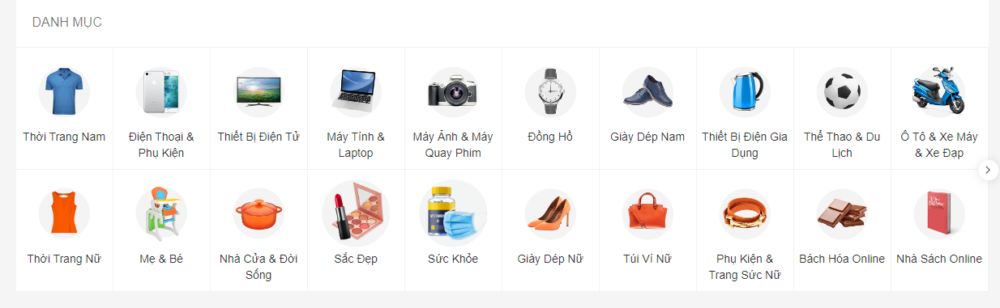
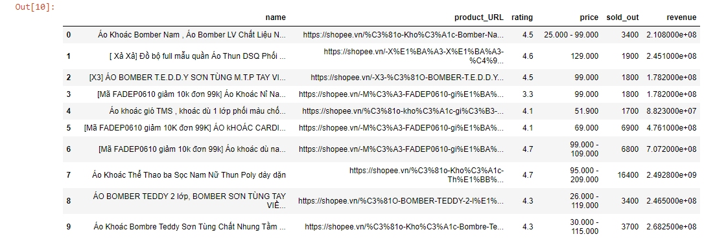

* ###### Project description:
  - Collect and handle data from Shopee.vn e-commerce
  - Take about at least 3k products from each big category

* ###### Flow project:

    + Step1: Take all the big categories on Shopee:
  
        + run file `find_all_url_parent_cate.py` -> `list_parent_categories.txt`

    + Step2: Take all the children categories of big categories: 
  
        + run file `find_all_url_children_cate.py` -> `list_children_categories.txt`
      
    + Step3: Take all products on 1-9 pages on each URL children categories:

        + run `main.py` -> MongoDB 

    + Step4: Load data from MongoDB to CSV
        + run `mongo_to_csv.py` -> `output_data.csv`
      
      

    
* ###### Evaluate the project:
  + Take almost 100% (evaluate by LOG) products** showing on all categies of [Shopee.vn]()
  + Collected about **133k products** within **9-10 hours** (about **220-240 products/minute**)