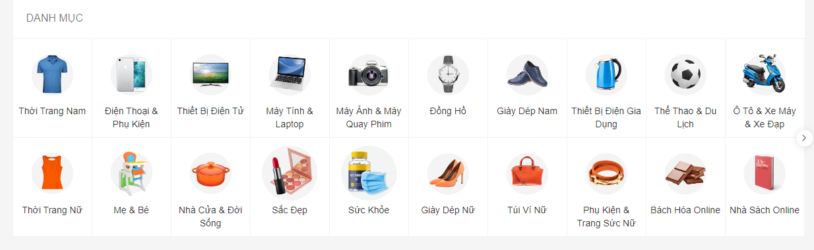

* ###### Project description:
  - Collect and handle data from Shopee e-commerce
  - Take about 3k products from big categories

* ###### Collect data flow:

    + Step1: Take all the big categories on Shopee:
  
        + run file `find_all_url_parent_cate.py` -> `list_parent_categories.txt`

    + Step2: Take all the children categories of big categories: 
  
        + run file `find_all_url_children_cate.py` -> `list_children_categories.txt`
      
    + Step3: Take all products on 1-9 pages on each URL children categories:

        + run `main.py` -> MongoDB 

    + Step4: Load data from MongoDB to CSV
        + run `mongo_to_csv.py` -> `data_products.csv`

* ###### Evaluate the project:
  + Take about **>95% products** showing on all categies of [Shopee.vn]()
  + Collected about **120k products** within **12 hours** (about **170 products/minute**)